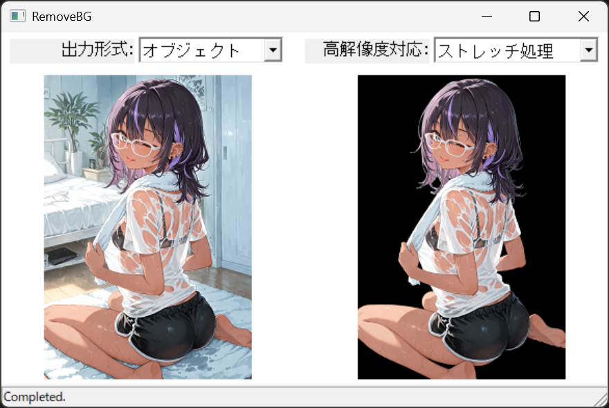
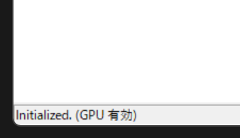

# RemoveBG
BiRefNetを使って画像の背景を除去するツールです。

# 使用条件
Windows

# 使い方
起動して画像ファイルをドロップしてください。（起動後数秒間は初期化してます）

# オプションの説明

## 出力形式
- **オブジェクト**
背景を抜いたアルファチャンネル付き画像で出力します。
- **マスク画像**
不透明度のマスク画像を出力します。

## 高解像度対応
- **ストレッチ処理**
画像全体を拡大縮小して処理します。細部のマスクがボケます。
- **タイリング処理**
画像を分割して処理します。綺麗だけど時間がかかります。画像の一部から判定するので、上手く切り抜けない場合もあります。

# GPUで動かすには
CUDAとcuDNNのインストールが必要です。 
一応うちの環境ではCUDAが12.8、cuDNNが9.18.1のバージョンで動いてます。

上手くいけば左下に「GPU有効」と表示されます。

