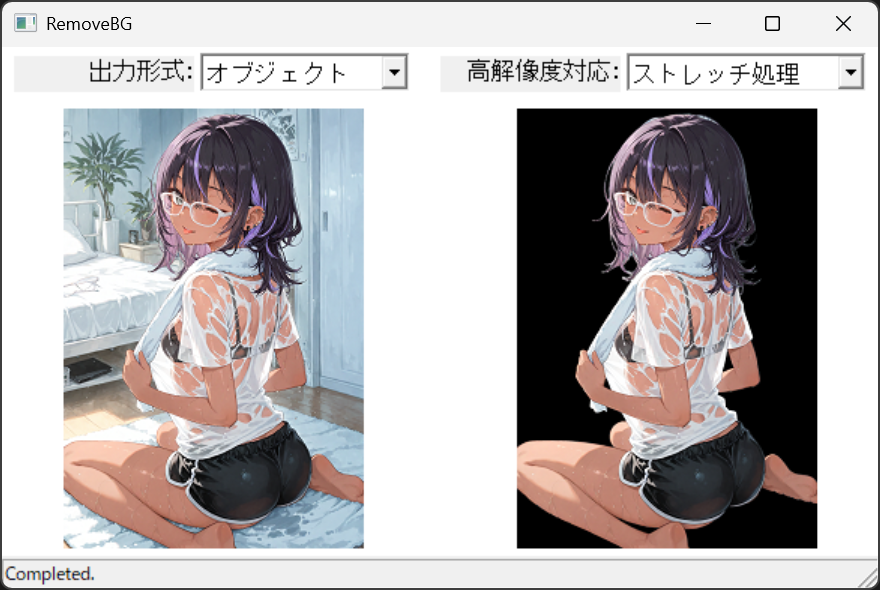
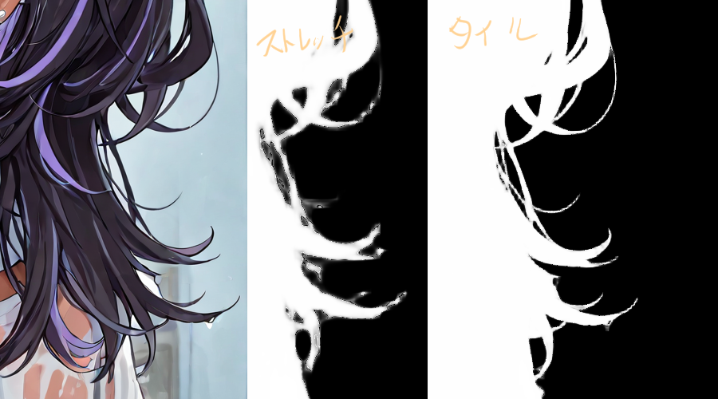
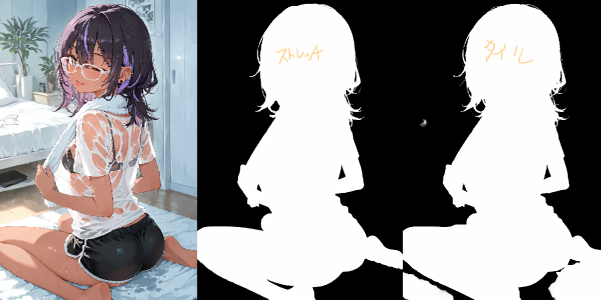
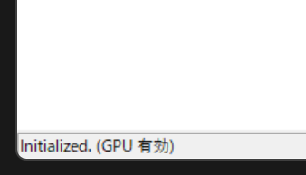

# RemoveBG
BiRefNetを使って画像の背景を除去するツールです。

# 使用条件
- Windows 11（たぶんWindows 10でも動きます）
- オフラインで動作（通信不要）<br>※ 初回起動時のみAIモデルをダウンロードします（約950MB）

# 使い方
起動して画像ファイルをドロップしてください。
（初回起動時はモデルファイルをダウンロードするので、しばらく待っていてください）


# オプションの説明

## 出力形式
- **オブジェクト**
背景を抜いたアルファチャンネル付き画像で出力します。
- **マスク画像**
不透明度のマスク画像を出力します。

## 高解像度対応
モデルの推奨サイズが 2048×2048px なので、それより大きい画像については複数の対応を設けてます。
- **ストレッチ処理**
画像全体を拡大縮小して処理します。細部のマスクがボケます。
- **タイリング処理**
画像を分割して処理します。綺麗だけど時間がかかります。画像の一部から判定するので、上手く切り抜けない場合もあります。

細部を拡大するとこんな感じでタイリングの方が優秀。


全体だとこういう感じでタイリングだと上手く抜けない部位がある。


# GPUで動かすには
TensorRT for RTX（RTX 30xx 以降）で GPU 推論します。以下が必要です。

- **CUDA 12.9 以上**
- **TensorRT for RTX SDK 1.4.x**（[NVIDIA Developer](https://developer.nvidia.com/tensorrt-rtx) から取得）
- **ONNX Runtime 1.24+** と **TensorRT RTX EP プラグイン**（`onnxruntime_providers_nv_tensorrt_rtx.dll`）

## 開発者向けセットアップ

1. TensorRT RTX SDK を `external/tensorrt-rtx/` に展開（`include/`, `lib/`, `bin/`）
2. EP プラグインの取得（SDK 配置後）:

```powershell
.\scripts\setup-trt-rtx-deps.ps1
.\scripts\deploy-bin.ps1
```

EP プラグインは [TensorRT-RTX-EP-ABI v0.1](https://github.com/NVIDIA/TensorRT-RTX-EP-ABI/releases/tag/v0.1.0) のプリビルドを使用します（ソースビルドには CUDA 12.9+ が必要）。

3. Visual Studio でビルド（PostBuild で `bin/` に DLL がコピーされます）

手動で DLL をコピーする場合:

```powershell
.\scripts\deploy-bin.ps1
```

## 実行時に必要な DLL（bin/ 同梱）

| DLL | 用途 |
|-----|------|
| `onnxruntime.dll` | ONNX Runtime 本体 |
| `onnxruntime_providers_shared.dll` | EP 共通 |
| `onnxruntime_providers_nv_tensorrt_rtx.dll` | TensorRT RTX EP プラグイン |
| `tensorrt_rtx_1_4.dll` | TensorRT RTX ランタイム |
| `tensorrt_onnxparser_rtx_1_4.dll` | ONNX パーサ |
| `tensorrt_plugins.dll` | TensorRT カスタムレイヤー |

初回起動時は JIT コンパイルのためモデル読み込みに時間がかかります。2 回目以降は `trt_rtx_cache/` のキャッシュで短縮されます。

RTX 30xx 未満の GPU や DLL 不足時は CPU モードで動作します。左下に「TensorRT RTX」または「CPU」と表示されます。

